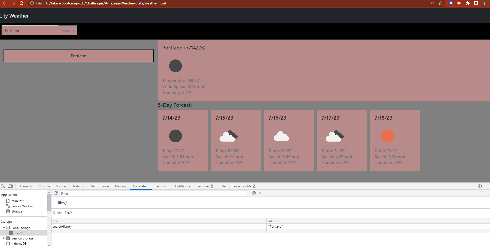
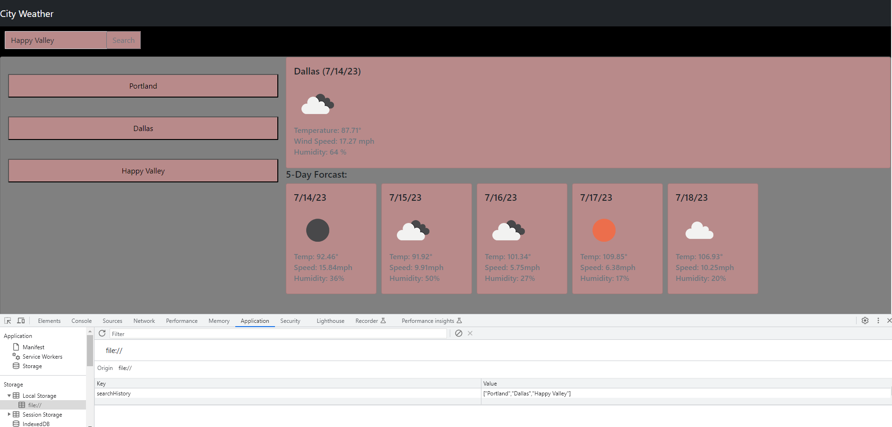

# Amazing-Weather-Data

  

  <h3 align="center">Jacobs Amazing weather forcast</h3>

  

    An awesome site to look up current weather in a city and future weather!
  

 
<h2 align="center"> Description</h2>

For my Challenge, I was tasked with making JavaScript functional weather page. It includes search bar and cards for informations. as well as a history to look at previously searched cities.
Making my weather page wasnt too bad since were doing a project thats very similar. Working with for loops has mostly been new to me and its been super usefull to loop over repetative tasks.I learned a lot from putting the weather site, mostly sifting through api calls and attaching them to the page.
 </b>

## Installation

Available with website link

[Amazing Weather]

(https://dupeaj.github.io/Jacob.Dupea-Amazing-Weather-data/)

## Photos

<h3 align="center">Website functions with interactions</h3>

  

  
 

## usage
<ul>
  <li>Press in the search box and type a city name.</li>
  <li>Click search(or press enter) to search that cities weather.</li>
  <li>Current conditions are presented in the top card.</li>
  <li>Weakly forcast is on the bottom cards.</li>
  <li>Previous searches are stored in the buttons on the left.</li>
   <li>Click a button on the left to view that cities weather data.</li>
</ul>

## License

License is a general MIT license. Refer to the License in the repo.
